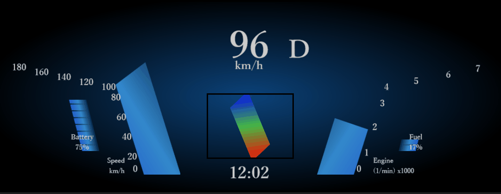

# cluster-app(Old UI version)

***This project doesn't have update plan.***

***Please use new UI version of cluster-app.***

[cluster-app](../cluster-app)

## Preview image



## How to run cluster app

```
npm install
npm start
```
Then, please access via web browser.

## How to deploy cluster app

```
npm install
npm run build
```
All necessary files are stored in to "build" directory.

Ex.) Launch server by python3
```
cd <path/to/build>
python3 -m http.server <PortNum>
```


## How to check license of dependencies package

```
npm install
npm run license
```
Please see package-license.csv

### Show unique license list

```
tail -n +2 package-license.csv| cut -d',' -f2 | sort | uniq
```

